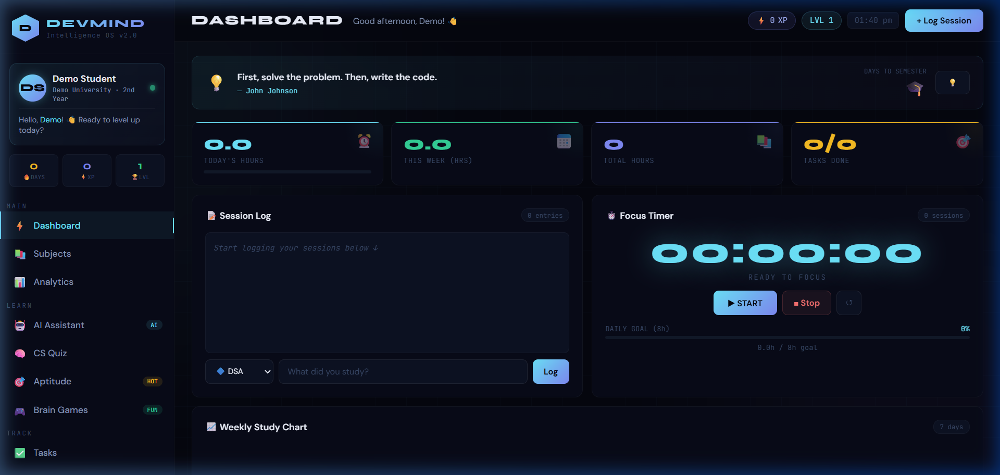

# DevMind — Student OS

Welcome to the **DevMind — Student OS**! This is a feature-rich, static web dashboard designed with a modern, dynamic UI to help students manage their performance, track subject scores, and organize goals.

## 📸 Screenshots



## 🚀 Live Demo

[View Live Dashboard](https://performance-report-nu.vercel.app/)

## ✨ Features

-   **Modern UI:** A stunning interface featuring glassmorphism, dynamic gradients, and smooth animations.
-   **Dashboard:** View overall performance, attendance, and recent activity.
-   **Subjects:** Track performance and study hours across multiple subjects.
-   **Goals:** Add and monitor short-term and long-term academic goals.
-   **Settings:** Customize your profile and appearance preferences.

## 🛠️ Built With

-   **HTML5**
-   **CSS3** (Custom Styles, Variables, Animations)
-   **Vanilla JavaScript**

## 💻 Running Locally

To run this project locally, simply clone the repository and open `index.html` in your favorite web browser:

```bash
git clone https://github.com/Jayaram5685/Performance_Report.git
cd Performance_Report

# Open index.html directly or serve using a local server
npx serve .
```
